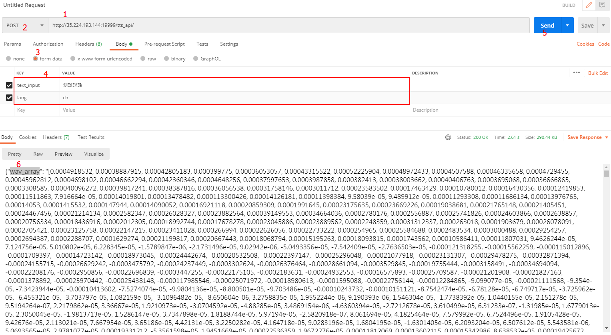

# TTS

## API介紹

### 輸入
包含兩個變數
+ `text_input`：要轉成語音的文字
+ `lang`：要轉換的語言
  + `ch`：中文
  + `en`：英文

### 輸出
一個JSON格式的dict，包含
+ `wav_array`：一個包含每個時刻聲紋振幅的array
  + 裡面的值為str的形態(使用時候需要轉換成數字)
+ `rtf`：產生1sec的音訊需要花費多少時間(單位：秒)

## 使用測試

### Web介面
測試URL：http://35.224.193.144:19999/demo/

在**文字框**輸入要轉換的文字並且選取好**語言**之後按**convert**送出

等待一段時間之後會收到回傳的json內容

### Postman
測試URL：http://35.224.193.144:19999/tts_api/

這邊使用[postman](https://www.postman.com/)來測試

1. 填入url
2. 選擇**POST**
3. 下面傳入資料選擇**from-data**
4. 輸入資料
   + `text_input`：要轉成語音的文字
   + `lang`：要轉換的語言
5. 按**Send**送出
6. 檢查回傳結果

